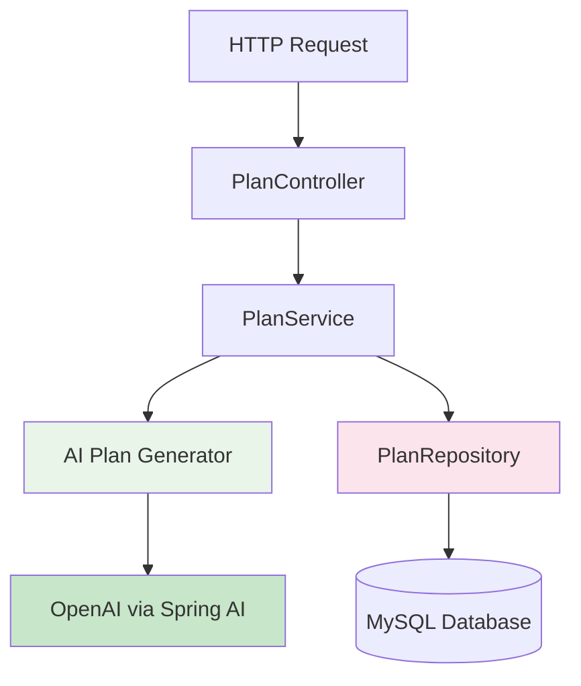

# 🤖 AI Personal Trainer Service

**AI-powered REST API** that generates personalized 4-week running training plans based on individual runner profiles and goals.

---

## ✨ **Core Capabilities**

### 🎯 **Personalized Plan Generation**
- **User-Level Based**: Tailored for Recreational, Competitive, or Elite runners
- **Flexible Scheduling**: Adapts to 4, 5, 6, or 7 training days per week
- **Distance Goals**: 5K, 10K, Half Marathon (21.1K), or Full Marathon (42.2K)
- **4-Week Progressive Structure**: Gradual mileage increase with proper recovery

### 🧠 **AI Intelligence**
- **Smart Workout Selection**: Mix of easy runs, intervals, tempo, and long runs
- **Progressive Overload**: Gradual intensity increase week-over-week
- **Recovery Optimization**: Built-in rest days and easy weeks
- **Goal-Specific Training**: Race-specific workouts for target distances

---

## 🛠️ **Technology Stack**

### **Backend Framework**

  
  

### **Artificial Intelligence**

  
  

### **Data & Integration**

  
  
  

### **Development Tools**

  
  

---

## 🏗️ **Architecture Overview**

---

## 📊 **Training Plan Matrix**

### **Runner Profiles**
| Level | Weekly Volume | Intensity | Recovery Focus |
|-------|---------------|-----------|----------------|
| 🟢 **Recreational** | 15-30 km | Low-Moderate | High |
| 🟡 **Competitive** | 30-60 km | Moderate-High | Medium |
| 🔴 **Elite** | 60-100+ km | High | Strategic |

### **Training Frequency**
| Days/Week | Pattern | Recovery Strategy |
|-----------|---------|-------------------|
| **4 Days** | Run/Rest Alternate | Ample recovery |
| **5 Days** | 3-1-1 Pattern | Built-in easy days |
| **6 Days** | 4-1-1 Pattern | Active recovery |
| **7 Days** | Daily Training | Recovery runs |

### **Distance Specialization**
| Race Distance | Key Workouts | Peak Long Run |
|---------------|--------------|---------------|
| **5K** | Intervals, Strides | 8-10K |
| **10K** | Tempo, Hill Repeats | 12-15K |
| **Half Marathon** | MP Runs, Progression | 18-20K |
| **Marathon** | Long MP, Back-to-Backs | 30-35K |

---

## 🔧 **Key Features**

### **Intelligent Adaptation**
- **Level-Appropriate** – Different plans for different experience levels
- **Volume Management** – Safe weekly mileage progression
- **Workout Variety** – Balanced mix of training stimuli
- **Recovery Integration** – Strategic rest and easy days

### **Technical Implementation**
- **RESTful API** – Clean, stateless endpoints
- **Microservice Ready** – Spring Cloud integration
- **Database Persistence** – Plan storage and retrieval
- **Error Handling** – Robust input validation and error responses

---

## ⚡ **Performance & Reliability**

- **Fast Response Times** – Cached plan generation
- **Scalable Design** – Handles multiple concurrent requests
- **Reliable AI Integration** – Fallback mechanisms for API failures
- **Data Integrity** – Transactional plan storage

---

  <b>🏃‍♀️ AI-Generated Plans • Professional Results • Instant Delivery 🏃‍♂️</b>

